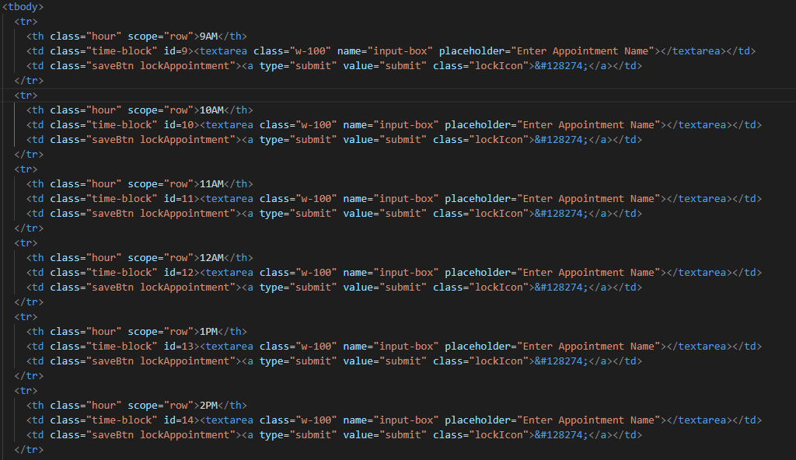
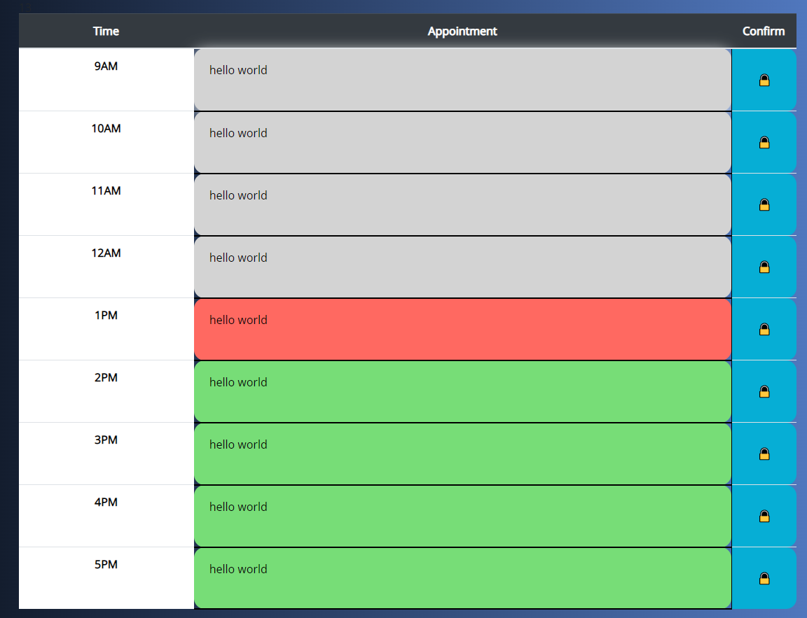
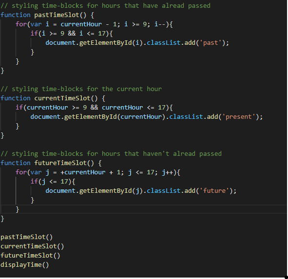

# NBM-Homework-05-Work-Day-Scheduler

MY USER STORY

AS AN Aspiring web developer and software engineer

I WANT to create a daily schedule planner that accounts for the current timestamp and displays what time slots are available or not for past, current, and future appointments

SO THAT I can showcase my javascript, bootstrap, moment and jquery fundamentals while also having a new schedule planner that I can use daily (and be proud of!)

SUPPLIED USER STORY

AS AN employee with a busy schedule

I WANT to add important events to a daily planner

SO THAT I can manage my time effectively

This assignment proved to be the most challenging for me as it was hard to figure out which task to tackle first. 

I decided to try my best to create a table with data cells that matched the example schedule planner but was unable to create something that closely resembled it. 

This is when I decided to take a closer look at the supplied css for this assignment. 

That is when I noticed that there were already classes that were premade to give my schedule the design I was looking for. 

The next challenge was to figure out where everything was supposed to go. I began by assigning the .hour class to my first column row to give it the white coloring with some additional formatting that I had added. 

Next was trying to create an input field for each time-block but felt that the input fields desgin/formatting looked a bit jarring with white text space inside of each time block. That is where I found the styling for textarea. After some research I found out that textarea is an accepted tag for html. Once adding the textarea tag to the time-block cells the design looked exactly how I would have liked. 

Before moving on to the javascript portion of this assignment, I wanted to make sure every element of the design process was completed. I likened this to the process of building a PC where the shell of the computer is the html, the internal components are the css and the javascript is the connection wires that put it all together.

Colored Time Blocks (Pre Save Button Fix):

Once my html and css sheets had been completed, I moved on to creating the functions that would color the time blocks based on what time it was when the user visited the website. 

The first function was for the .past class where all previous time blockes were colored gray. To achieve this, I decided to give id's based on military time for each time block with a placeholder moment(). function to show the current time based on hourly increments from 0-24. 

Once I figured out how to iterate through the time blocks backwards through a for loop I had moved on to the .present class function. This was acheived through an if statement that just checks if the current hour was between the hours of 9AM and 5PM. 

Finally, I created the .future class function where it iterates forwards from the current hour and stops once the time surpasses 5PM.

Time Block Styling Code:

The final step was to create a series of functions for inputting text into the time block field and having it save to the local storage to be viewed in the same position later.

One of the key things I knew I had to incorporate was to set items to the local storage when text was saved as well as a preventDefault call to avoid having the page reload whenever a button was clicked. 

Given more time, I would have liked to add in a condition that makes it so users are unable to add appointments to time blocks that have already passed for that day, as well as reseting the input fields once the clock hits midnight.

[DeployedSchedulePlannerApplication](https://nathanmilburn.github.io/NBM-Homework-05-Work-Day-Scheduler/)
[DeployedSchedulePlannerRepository](https://github.com/NathanMilburn/NBM-Homework-05-Work-Day-Scheduler)